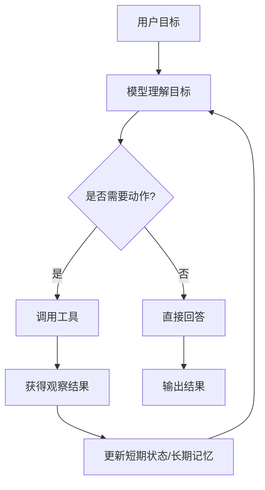
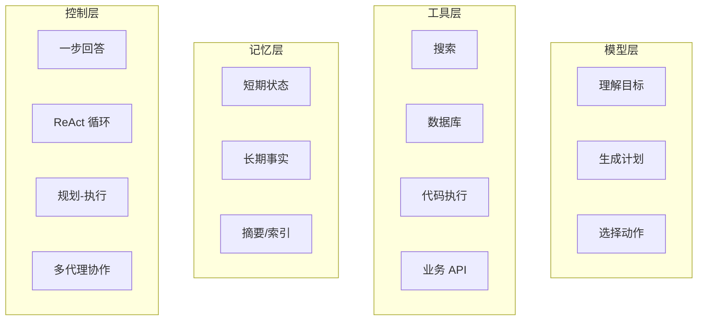
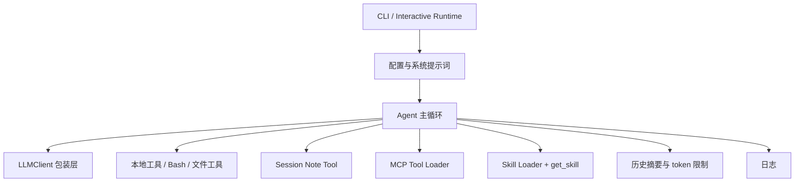

# 智能体概括

> 适合谁
>
> 1. 刚开始学智能体，不想一上来就被论文和框架名词淹没。
> 2. 已经会调用模型 API，但还不知道怎么把它做成“会做事的系统”。
> 3. 想系统理解工具、记忆、行为模式、多智能体之间的关系。

## 1. 先用一句话认识智能体

普通大模型应用更像“单次回答器”，输入一段上下文，输出一段文本。  
智能体则更像“带循环的系统”：它会读目标、看状态、选动作、调工具、读结果、更新记忆，必要时继续下一步。[1][2][3]

你可以先把它记成下面这个最小公式：

```text
智能体 = 模型 + 工具 + 记忆/状态 + 控制循环
```

## 2. 一张图看懂全局



这张图里有 4 个核心问题：

1. `工具` 怎么设计，模型才会稳定调用？
2. `记忆` 怎么设计，模型才不会每轮都像失忆？
3. `行为模式` 怎么设计，模型才知道先做什么、后做什么？
4. `多智能体` 什么时候值得上，什么时候只是徒增复杂度？

这 4 个问题分别对应本教程的 4 个专题文档：

1. [工具调用](./工具调用.md)
2. [记忆模块](./记忆模块.md)
3. [智能体行为模式](./智能体行为模式.md)
4. [多智能体架构设计](./多智能体架构设计.md)

## 3. 把智能体拆成 4 层



### 3.1 模型层

模型层负责“理解”和“决策”。它不直接连接真实世界，而是通过上下文知道：

1. 现在的目标是什么。
2. 当前可用工具有哪些。
3. 已经发生过什么。
4. 下一步应该做什么。[1][2]

### 3.2 工具层

工具层把外部能力暴露给模型。常见工具包括：

1. 搜索工具
2. 浏览器工具
3. 数据库工具
4. Python/代码执行工具
5. 内部业务 API

工具层解决的问题不是“模型会不会说”，而是“模型能不能查、能不能算、能不能执行”。[4][5][6]

### 3.3 记忆层

记忆层让系统不只依赖当前输入。它通常分成：

1. `短期状态`：本轮任务刚发生的事。
2. `长期记忆`：跨会话的用户偏好、业务事实、经验卡片。
3. `知识检索层`：需要时再把相关内容拉进上下文。[7][8][9]

### 3.4 控制层

控制层决定系统如何运行：

1. 直接回答
2. 先规划再执行
3. 反复“思考 -> 行动 -> 观察”
4. 多个代理分工合作。[3][10][11]

很多人学智能体时最大的误区，是把注意力全放在模型参数上，而忽略了控制层。实际上，很多“这个系统为什么忽然变聪明了”的原因，不在模型换代，而在工作流换代。[1][3][10]

## 4. 一个最小智能体示例

下面这段代码故意写得很小，目的不是生产可用，而是帮助你建立“智能体循环”的直觉。

```python
from dataclasses import dataclass, field


def search_docs(query: str) -> str:
    kb = {
        "MCP": "MCP 是一种标准化外部能力接入协议。",
        "RAG": "RAG 是检索增强生成，把外部知识拉进上下文。",
    }
    return kb.get(query, "没有找到相关资料")


@dataclass
class AgentState:
    short_history: list[str] = field(default_factory=list)


def tiny_agent(user_goal: str, state: AgentState) -> str:
    state.short_history.append(f"用户: {user_goal}")

    if "什么是" in user_goal:
        keyword = user_goal.replace("什么是", "").strip(" ?？")
        tool_result = search_docs(keyword)
        state.short_history.append(f"工具结果: {tool_result}")
        answer = f"我查到的结果是：{tool_result}"
    else:
        answer = "这个最小示例只处理“什么是 X”这类问题。"

    state.short_history.append(f"助手: {answer}")
    return answer


state = AgentState()
print(tiny_agent("什么是 MCP？", state))
print(state.short_history)
```

这段代码已经有了智能体的 4 个基本部件：

1. `模型决策的影子`：这里用 if/else 代替真实模型决策。
2. `工具`：`search_docs`。
3. `记忆`：`short_history`。
4. `循环`：先判断，再查，再写回状态，再输出。

等你把“if/else”换成真实 LLM，把 `search_docs` 换成外部 API，把 `short_history` 换成真正的状态存储，你就从“玩具代理”迈到了“工程代理”的起点。

## 5. 这一套教程怎么学最顺

建议按下面顺序读：

1. 先看 [工具调用](./工具调用.md)
   因为没有工具，智能体大多只是“能聊的程序”。
2. 再看 [记忆模块](./记忆模块.md)
   因为没有记忆，系统很难长任务稳定工作。
3. 再看 [智能体行为模式](./智能体行为模式.md)
   因为你需要知道什么时候一步答，什么时候 ReAct，什么时候先规划。
4. 最后看 [多智能体架构设计](./多智能体架构设计.md)
   因为多代理是进阶能力，不是默认起点。

## 6. 跨厂商怎么看

本套文档不会把“跨厂商实践”单独放成一章，而是分散到各个专题里。你读到对应主题时，会看到下面这些厂商的做法：

| 主题 | 你会看到哪些厂商实践 |
| --- | --- |
| 工具调用 | OpenAI、Anthropic、Moonshot/Kimi、智谱、MiniMax、MCP |
| 记忆模块 | OpenAI、Anthropic、Moonshot/Kimi、智谱、Letta、LangGraph |
| 行为模式 | OpenAI、Anthropic、Google ADK、MiniMax |
| 多智能体 | Google ADK、OpenAI Agents SDK、AutoGen、CrewAI、MetaGPT、MiniMax |

这样安排的原因很简单：  
学习时最怕“先按厂商分，再按概念分”，最后脑子里一团乱。更好的方式是先按问题分，再在每个问题下看不同厂商的答案。

## 7. 真实项目从哪看起

下面这些项目非常适合配合教程一起看：

| 项目 | 适合配合哪一章 | 你重点看什么 |
| --- | --- | --- |
| `MiniMax-AI/Mini-Agent` | 概括、工具、记忆、行为模式 | 完整单代理执行循环、Session Note、上下文摘要、MCP、Skills |
| `openai/openai-agents-python` | 工具调用、行为模式、多智能体 | agent、handoff、guardrail、tool 封装 |
| `langchain-ai/langgraph` | 记忆模块、行为模式 | state、graph、checkpointer、memory |
| `letta-ai/letta` | 记忆模块 | stateful agents、长期记忆、记忆读写 |
| `modelcontextprotocol/servers` | 工具调用 | MCP server 如何暴露 tools/resources/prompts |
| `All-Hands-AI/OpenHands` | 行为模式 | 复杂任务中的工具循环、规划和修正 |
| `microsoft/autogen` | 多智能体 | agent 间协作和对话控制 |
| `crewAIInc/crewAI` | 多智能体 | 角色分工、任务委派 |
| `FoundationAgents/MetaGPT` | 多智能体 | 把组织流程映射为代理团队 |

## 8. 学完这套教程后，你应该会什么

如果你能把 5 篇都看完并跟着最小代码敲一遍，你应该能回答下面这些问题：

1. 为什么工具调用不是“模型自己执行代码”？
2. RAG、上下文、记忆、提示词工程、eval harness 到底在哪一层？
3. ReAct 和“先规划后执行”有什么区别？
4. 多智能体什么时候有意义，什么时候只是架构炫技？
5. MCP 和 Skill 分别解决什么问题？

如果这些问题你都能用自己的话讲清楚，你就已经超过“只会调 API”的阶段了。

## 9. 案例速读：为什么 Mini-Agent 很适合当教学项目

MiniMax 的 [Mini-Agent](https://github.com/MiniMax-AI/Mini-Agent/) 特别适合拿来做“教程级案例”，原因不是它把一切都做得很重，而是它把一个现代单代理系统最关键的骨架拼得比较完整：[20][21]



如果你顺着仓库去读，会发现它几乎把“单代理工程化”最关键的几个点都串起来了：

1. `统一 LLM 接口`
   `mini_agent/llm/llm_wrapper.py` 同时兼容 Anthropic 风格和 OpenAI 风格接口，并对 MiniMax 域名做 provider-aware 路径适配。[24]
2. `完整执行循环`
   `mini_agent/agent.py` 里有真正的 step-loop：调用模型、打印 thinking、执行 tool、写回 tool result、检查取消、达到步数上限后退出。[21]
3. `简化但清楚的记忆`
   `note_tool.py` 用 `record_note` 和 `recall_notes` 做了最小长期记忆原型；`agent.py` 又在 token 超限时做历史摘要。[21][22]
4. `能力扩展层`
   本地工具之外，它还接了 MCP，并且把 Skills 做成渐进加载：先给 metadata，再按需 `get_skill`。[20][23]

它给初学者最重要的启发是：

1. 先把单代理的工具、记忆、上下文治理和日志做好。
2. 再考虑要不要上更复杂的多代理。
3. 很多“高级感”并不来自代理数量，而来自执行循环是否扎实。（综合归纳）[20][21][22]

## 参考来源

[1] OpenAI, Building agents.  
https://developers.openai.com/tracks/building-agents

[2] Anthropic, How to implement tool use.  
https://docs.anthropic.com/en/docs/agents-and-tools/tool-use/implement-tool-use

[3] Google ADK Docs, Multi-Agent Systems in ADK.  
https://google.github.io/adk-docs/agents/multi-agents/

[4] OpenAI, Function calling.  
https://platform.openai.com/docs/guides/function-calling

[5] Model Context Protocol, Architecture overview.  
https://modelcontextprotocol.io/docs/learn/architecture

[6] OpenAI Developers, Agent Skills – Codex.  
https://developers.openai.com/codex/skills

[7] LangGraph Docs, Memory overview.  
https://docs.langchain.com/oss/javascript/langgraph/memory

[8] Lewis et al., Retrieval-Augmented Generation for Knowledge-Intensive NLP Tasks, arXiv:2005.11401.  
https://arxiv.org/abs/2005.11401

[9] Letta Docs, Intro.  
https://docs.letta.com/

[10] Yao et al., ReAct, arXiv:2210.03629.  
https://arxiv.org/abs/2210.03629

[11] Wang et al., Plan-and-Solve Prompting, arXiv:2305.04091.  
https://arxiv.org/abs/2305.04091

[12] OpenAI Agents SDK GitHub.  
https://github.com/openai/openai-agents-python

[13] LangGraph GitHub.  
https://github.com/langchain-ai/langgraph

[14] Letta GitHub.  
https://github.com/letta-ai/letta

[15] MCP Servers GitHub.  
https://github.com/modelcontextprotocol/servers

[16] OpenHands GitHub.  
https://github.com/All-Hands-AI/OpenHands

[17] AutoGen GitHub.  
https://github.com/microsoft/autogen

[18] CrewAI GitHub.  
https://github.com/crewAIInc/crewAI

[19] MetaGPT GitHub.  
https://github.com/FoundationAgents/MetaGPT

[20] Mini-Agent GitHub README.  
https://github.com/MiniMax-AI/Mini-Agent/blob/main/README.md

[21] Mini-Agent `agent.py`.  
https://github.com/MiniMax-AI/Mini-Agent/blob/main/mini_agent/agent.py

[22] Mini-Agent `note_tool.py`.  
https://github.com/MiniMax-AI/Mini-Agent/blob/main/mini_agent/tools/note_tool.py

[23] Mini-Agent `skill_tool.py`.  
https://github.com/MiniMax-AI/Mini-Agent/blob/main/mini_agent/tools/skill_tool.py

[24] Mini-Agent `llm_wrapper.py`.  
https://github.com/MiniMax-AI/Mini-Agent/blob/main/mini_agent/llm/llm_wrapper.py