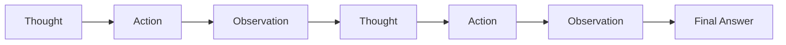
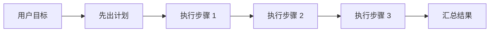
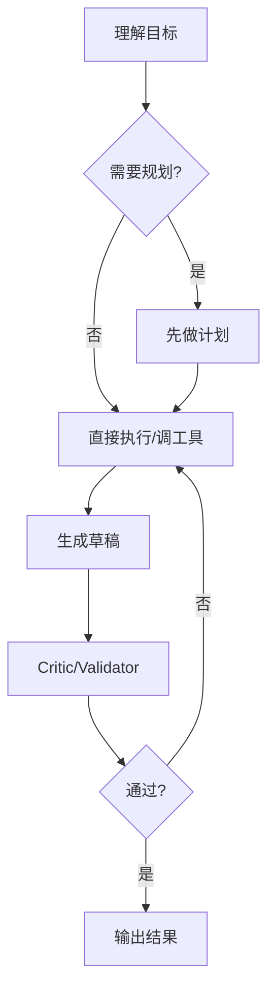

# 智能体行为模式

> 这一章你会学会什么
>
> 1. 行为模式为什么是智能体的“操作系统”。
> 2. ReAct、Plan-and-Solve、MRKL、Tree of Thoughts、Generator-Critic 分别适合什么问题。
> 3. 怎样给自己的智能体选一个更稳的默认循环。
> 4. 哪些真实项目在用这些模式。

## 1. 什么叫“行为模式”

行为模式就是：  
`智能体遇到任务后，按什么步骤思考、行动、校验、停止。`

同样一个模型，不同行为模式，效果可能差很多。  
因为决定系统表现的，往往不只是“模型会不会”，而是“系统让模型什么时候查、什么时候停、什么时候修正”。[1][2][3]

## 2. 五种最重要的模式

### 2.1 一步回答

适合：

1. 问题非常短
2. 不需要外部工具
3. 不需要长流程

```text
用户问题 -> 模型直接回答
```

这是最简单的模式，也是很多任务的正确选择。  
不要为了“更像智能体”强行上复杂循环。

### 2.2 ReAct

ReAct = `Reason + Act`。  
模型一边推理，一边行动，一边根据观察修正下一步。[1]



适合：

1. 需要查资料再决定
2. 工具结果会改变后续路径
3. 问题不是一句话能答完

### 2.3 Plan-and-Solve / Planner-Executor

先规划，再执行。[2]



适合：

1. 多步骤任务
2. 调用成本高，不适合乱试
3. 需要先确认路径，再进入执行

### 2.4 Generator-Critic

先生成，再批判，再修正。  
Google ADK 把 review/critique 和 iterative refinement 作为常见模式列出来。[3]

适合：

1. 代码生成
2. 报告生成
3. 高风险配置变更
4. 需要质量门槛的长输出

### 2.5 Tree of Thoughts

不是只走一条路，而是生成多个候选“思路分支”，再筛选最优。[4]

适合：

1. 需要方案搜索
2. 容易局部最优
3. 能对中间解打分

## 3. 一个最小 ReAct 示例

下面的代码不是调用真实模型，而是用规则模拟 ReAct 循环，让你先建立直觉。

```python
def search_docs(query: str) -> str:
    kb = {
        "MCP": "MCP 是标准化工具接入协议",
        "ReAct": "ReAct 是推理和行动交替的模式",
    }
    return kb.get(query, "未找到")


def simple_react_agent(goal: str) -> str:
    steps = []

    if "什么是" in goal:
        thought = "我需要先查资料再回答"
        steps.append(f"Thought: {thought}")

        keyword = goal.replace("什么是", "").strip(" ?？")
        steps.append(f"Action: search_docs({keyword})")

        observation = search_docs(keyword)
        steps.append(f"Observation: {observation}")

        final_answer = f"Final Answer: {observation}"
        steps.append(final_answer)
        return "\n".join(steps)

    return "Final Answer: 这个最小示例只处理“什么是 X”问题。"


print(simple_react_agent("什么是 MCP？"))
```

你可以清楚看到 4 个阶段：

1. Thought
2. Action
3. Observation
4. Final Answer

这就是 ReAct 的骨架。

## 4. 再看一个“先规划后执行”最小示例

```python
def plan_and_execute(goal: str) -> dict:
    plan = [
        "先识别用户到底要什么",
        "再查相关知识",
        "最后组织成清晰答案",
    ]

    execution_log = []
    for step in plan:
        execution_log.append(f"执行: {step}")

    return {
        "plan": plan,
        "result": "已完成一轮简化版 plan-and-solve",
        "log": execution_log,
    }


print(plan_and_execute("写一段关于 MCP 的解释"))
```

这个模式和 ReAct 的区别是：

1. ReAct 更强调边走边看
2. Plan-and-Solve 更强调先把路径定出来

## 5. 热门模式怎么选

| 模式 | 你应该在什么时候用 | 它的风险 |
| --- | --- | --- |
| 一步回答 | 简单问答、低成本任务 | 容易在复杂任务里失控 |
| ReAct | 需要边查边做 | 可能陷入无效循环 |
| Plan-and-Solve | 多步任务、成本高 | 计划写得太细会拖慢 |
| Generator-Critic | 要质量审查 | 时延更高 |
| Tree of Thoughts | 需要多方案搜索 | token 成本高 |

## 6. 论文视角：这些模式各自解决什么问题

### 6.1 ReAct

解决：  
“只推理不行动”或“只行动不解释”的断裂问题。[1]

### 6.2 MRKL

MRKL 强调模块化路由：语言模型负责协调，外部模块负责更可靠的知识或计算。[5]

这更像架构思想，而不是单一 prompt 技巧。

### 6.3 Toolformer

Toolformer 说明“何时调用工具”本身也可以成为模型能力的一部分。[6]

### 6.4 Plan-and-Solve

解决零样本链式推理里“漏步骤”的问题。[2]

### 6.5 Tree of Thoughts

解决单路径思考容易走死的问题。[4]

## 7. 跨厂商实践

### 7.1 OpenAI：强调 agent workflow，而不是只会调模型

OpenAI 的 building agents 轨道文档强调的是完整 agent system：模型、工具、评估、状态和工作流。[7]  
对学习者最重要的启发是：  
别把行为模式理解成“prompt 花活”，它应该落实到系统流程。

### 7.2 Anthropic：行为模式离不开评估和模板化

Anthropic 的 prompt templates、eval tool 等文档说明：  
如果没有模板化和评估，行为模式很难稳定复现。[8][9]

也就是说：

1. 好模式不只靠灵感
2. 还要靠模板和评估把它固化下来

### 7.3 Google ADK：把模式正式做成工作流

Google ADK 很值得学的一点是，它不只讲概念，而是明确给出顺序、并行、层级、review 等模式。[3]  
这对初学者非常友好，因为你能直接把“论文里的思路”映射成“工程里的工作流节点”。

### 7.4 MiniMax：强调工具链中的状态连续性

MiniMax 在工具使用和交错思维链的文档里强调，历史回传不能乱裁剪。[10]  
这和行为模式直接相关，因为一个复杂行为模式要成立，前提就是“上一步状态能被下一步正确继承”。

## 8. 真实项目怎么学

### 8.1 `All-Hands-AI/OpenHands`

适合看：

1. 复杂任务如何持续调用工具
2. 出错后如何修正
3. 代码任务里的长循环怎么跑

项目地址：  
https://github.com/All-Hands-AI/OpenHands

### 8.2 `langchain-ai/langgraph`

适合看：

1. ReAct agent 的图结构组织
2. planner、tool node、memory node 如何组合

项目地址：  
https://github.com/langchain-ai/langgraph

### 8.3 `openai/openai-agents-python`

适合看：

1. agent loop 的封装方式
2. handoff 与 guardrail

项目地址：  
https://github.com/openai/openai-agents-python

### 8.4 `MiniMax-AI/Mini-Agent`

Mini-Agent 不是“论文模式集合”，但它非常适合拿来观察一个可工作的单代理执行循环：

1. 每轮先检查是否要做历史摘要
2. 调用 LLM
3. 把 assistant thinking / content / tool_calls 写进消息历史
4. 顺序执行工具
5. 把 tool result 写回历史
6. 如果没有 tool calls，就结束；否则继续下一轮。[14]

这其实就是一个非常典型的 `ReAct 风格工程循环`，只是它额外补上了：

1. 取消执行的安全清理
2. token 超限摘要
3. 详细日志
4. 最大步数保护

也正因为这样，Mini-Agent 很适合用来提醒我们：  
真正能落地的行为模式，不只是“有 Thought/Action/Observation 这几个词”，而是要把停止条件、清理策略、上下文压缩和错误处理一起做进去。（综合归纳）[14][15]

项目地址：  
https://github.com/MiniMax-AI/Mini-Agent

## 9. 一个推荐的默认循环

对大多数业务系统，一个很稳的默认循环是：



你可以把它理解成：

1. 能简单就简单
2. 需要时加 planner
3. 有风险时加 critic
4. 别默认把一切都做成重型 agent

## 10. 这一章的练习

1. 把 ReAct 示例改成“两次工具调用”的版本。
2. 给 plan-and-solve 示例补一个“计划审查器”。
3. 设计一个“回答生成器 + 审查器”的双阶段流程。

## 参考来源

[1] Yao et al., ReAct, arXiv:2210.03629.  
https://arxiv.org/abs/2210.03629

[2] Wang et al., Plan-and-Solve Prompting, arXiv:2305.04091.  
https://arxiv.org/abs/2305.04091

[3] Google ADK Docs, Multi-Agent Systems in ADK.  
https://google.github.io/adk-docs/agents/multi-agents/

[4] Yao et al., Tree of Thoughts, arXiv:2305.10601.  
https://arxiv.org/abs/2305.10601

[5] Karpas et al., MRKL Systems, arXiv:2205.00445.  
https://arxiv.org/abs/2205.00445

[6] Schick et al., Toolformer, arXiv:2302.04761.  
https://arxiv.org/abs/2302.04761

[7] OpenAI, Building agents.  
https://developers.openai.com/tracks/building-agents

[8] Anthropic, Use prompt templates and variables.  
https://docs.anthropic.com/en/docs/build-with-claude/prompt-engineering/prompt-templates-and-variables

[9] Anthropic, Using the Evaluation Tool.  
https://docs.anthropic.com/en/docs/test-and-evaluate/eval-tool

[10] MiniMax 开放平台文档中心, 工具使用 & 交错思维链.  
https://platform.minimaxi.com/docs/guides/text-m2-function-call

[11] OpenHands GitHub.  
https://github.com/All-Hands-AI/OpenHands

[12] LangGraph GitHub.  
https://github.com/langchain-ai/langgraph

[13] OpenAI Agents SDK GitHub.  
https://github.com/openai/openai-agents-python

[14] Mini-Agent `agent.py`.  
https://github.com/MiniMax-AI/Mini-Agent/blob/main/mini_agent/agent.py

[15] Mini-Agent GitHub README.  
https://github.com/MiniMax-AI/Mini-Agent/blob/main/README.md