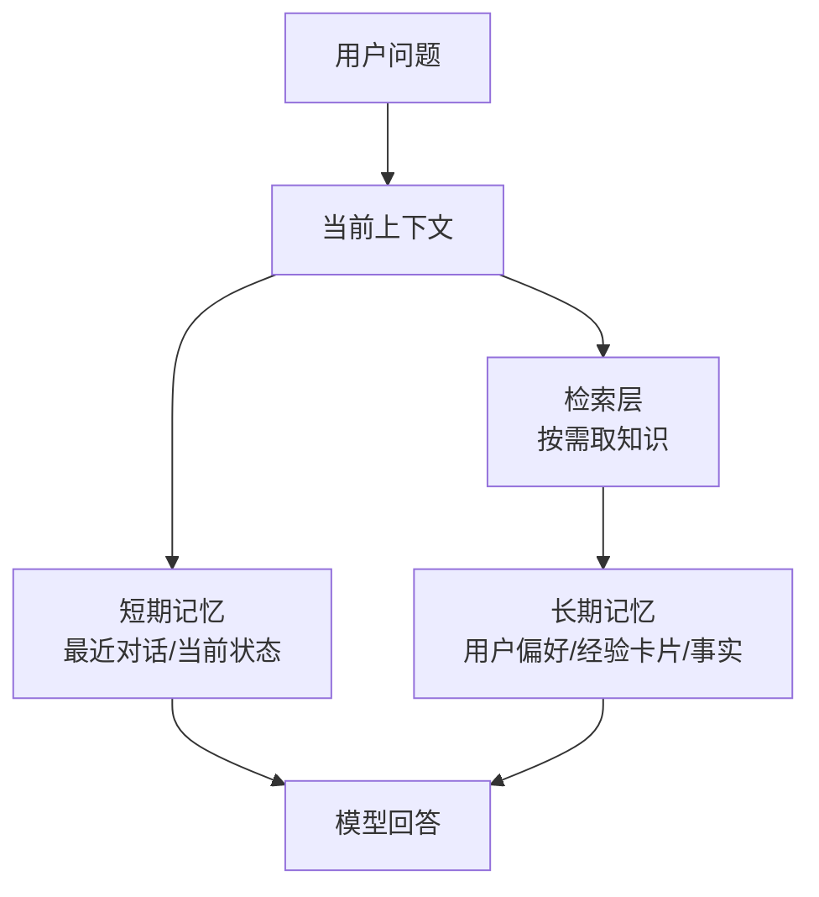
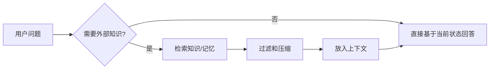

# 记忆模块

> 这一章你会学会什么
>
> 1. 智能体为什么需要记忆。
> 2. 短期记忆、长期记忆、RAG、上下文、提示词工程、eval harness 的区别。
> 3. 如何设计一个更稳的记忆模块，减少幻觉。
> 4. 不同厂商和真实项目是怎么处理记忆与上下文的。

## 1. 为什么没有记忆，智能体就很弱

如果没有记忆，智能体每一轮都像在“失忆重开”：

1. 忘记用户偏好
2. 忘记上一步查到了什么
3. 忘记任务进行到哪一步
4. 忘记过去哪些做法有效

LangGraph、Letta、MemGPT 这些系统都把 memory 视为核心能力，而不是可有可无的外挂。[1][2][3]

## 2. 一张图看懂记忆分层



最重要的一句话是：

```text
上下文不等于记忆，记忆也不等于 RAG。
```

## 3. 先把几个容易混的概念分清

### 3.1 上下文

上下文是“这一轮真正送进模型的所有内容”。  
它可能包括：

1. system prompt
2. 用户输入
3. 历史对话
4. 工具定义
5. 工具结果
6. 检索片段

### 3.2 短期记忆

短期记忆是当前线程/当前任务的工作记忆。  
例如：

1. 用户刚上传了什么文件
2. 上一步工具返回了什么
3. 当前任务进行到第几步

### 3.3 长期记忆

长期记忆跨会话存在。  
例如：

1. 用户偏好中文回答
2. 某客户项目用 PostgreSQL
3. 上次部署踩过什么坑

### 3.4 RAG

RAG 是“从外部知识源按需检索相关内容，再送进本轮上下文”。[4]

它解决的是：  
`本轮需要哪些外部知识。`

### 3.5 提示词工程

提示词工程解决的是：  
`模型应该按什么方式思考和输出。`

它本身不提供新知识，只是约束行为。[5][6]

### 3.6 Eval Harness

Harness / Evals 解决的是：  
`这套记忆和上下文设计到底好不好。`

例如：

1. 引用是否准确
2. 资料不足时是否拒答
3. 长任务是否丢状态
4. 记忆写入是否污染系统

## 4. 一个最小记忆示例

下面是一个非常适合初学者理解的最小例子：  
我们把“最近对话”当短期记忆，把“用户偏好”和“经验卡片”当长期记忆。

```python
from dataclasses import dataclass, field


@dataclass
class Memory:
    short_history: list[str] = field(default_factory=list)
    user_profile: dict = field(default_factory=dict)
    knowledge_cards: list[str] = field(default_factory=list)


def retrieve_cards(query: str, cards: list[str]) -> list[str]:
    query_words = set(query.lower().split())
    ranked = []
    for card in cards:
        score = len(query_words & set(card.lower().split()))
        ranked.append((score, card))
    ranked.sort(reverse=True)
    return [card for score, card in ranked if score > 0][:3]


def answer_question(query: str, memory: Memory) -> str:
    memory.short_history.append(f"用户: {query}")

    recalled = retrieve_cards(query, memory.knowledge_cards)
    language = memory.user_profile.get("language", "中文")

    context_hint = "；".join(recalled) if recalled else "暂无相关长期记忆"
    answer = f"用{language}回答。已召回记忆：{context_hint}"

    memory.short_history.append(f"助手: {answer}")
    return answer


memory = Memory(
    user_profile={"language": "中文"},
    knowledge_cards=[
        "MCP 是标准化工具接入协议",
        "用户喜欢先看结论再看细节",
        "RAG 是检索增强生成",
    ],
)

print(answer_question("MCP 是什么", memory))
```

### 4.1 这段代码体现了什么

1. `short_history`
   当前会话的短期状态
2. `user_profile`
   稳定偏好
3. `knowledge_cards`
   长期知识卡片
4. `retrieve_cards`
   不是把所有记忆都塞进上下文，而是先召回相关记忆

这就是很多真实系统的最小雏形。

## 5. 一个更稳的记忆模块应该怎么设计

### 5.1 分层存

不要把所有内容都放在一个巨大列表里。  
最少分成：

1. 对话历史
2. 当前任务状态
3. 长期用户画像
4. 长期经验卡片
5. 外部知识库索引

### 5.2 只在需要时召回

很多初学者会做一件事：  
把所有历史对话、所有文档、所有工具结果，一口气全拼进 prompt。

这是非常不稳的。  
正确思路通常是：

1. 先判断本轮需要什么
2. 再只召回相关内容
3. 再把这些内容放进上下文

这正是 RAG 和记忆召回系统的意义。[1][4]

### 5.3 让旧历史可压缩

对话一长，就要做摘要。  
Generative Agents、MemGPT、LangGraph 都说明了一个事实：  
长时代理系统必须学会压缩旧历史，而不是无限追加。[1][2][7]

### 5.4 长期记忆尽量只存“高价值、已验证”的内容

适合长期写入的：

1. 稳定偏好
2. 已确认事实
3. 经验证有效的流程
4. 经常复用的摘要卡片

不适合长期写入的：

1. 一次性闲聊
2. 未经验证的模型猜测
3. 已经过期的临时状态
4. 带强隐私但没有治理边界的信息

## 6. 如何减少幻觉

减少幻觉的重点，不是“上下文越长越好”，而是：

1. 上下文更相关
2. 信息更可验证
3. 旧历史被合理压缩
4. 真的不知道时允许拒答

### 6.1 一个常用策略



### 6.2 简单实用的 5 条规则

1. 不相关的老消息删掉或摘要掉。
2. 稳定说明放前面，动态内容放后面。[5]
3. 外部知识优先来自工具或检索结果，而不是凭空猜。
4. 长期记忆写入前先筛选。
5. 用 eval 样本持续检查“是否乱记、乱引、乱答”。[6]

## 7. 跨厂商实践

### 7.1 OpenAI：把稳定内容前置，并提供 prompt caching

OpenAI 的 prompt caching 文档给了一个很实用的工程建议：  
把稳定 instructions 和重复内容放在 prompt 前部，有利于缓存命中，也有利于成本控制。[5]

这对记忆设计的启发是：

1. 稳定规则和模板不要每轮重新组织顺序。
2. 长期稳定的上下文块适合做缓存友好布局。

### 7.2 Anthropic：把模板和变量分开

Anthropic 明确建议使用 prompt templates and variables，把固定结构和动态变量拆开。[8]  
这对记忆系统很重要，因为很多“伪记忆”其实只是模板问题。

比如：

1. 固定角色说明不是长期记忆
2. 用户名字、项目名这类变量也不一定要写进长期记忆
3. 先区分模板变量和真正需要长期保存的信息，系统会干净很多

### 7.3 Moonshot / Kimi：上下文缓存和 RAG 不是二选一教条

Moonshot 官方博客非常适合初学者建立“成本观”：  
当大量问题反复依赖同一大段静态上下文时，context caching 可能比每轮都做 RAG 更划算；但如果知识库规模很大、问题差异很大，RAG 仍然更通用。[9][10]

这对工程设计的启发是：

1. 记忆和检索不仅是准确率问题，也是成本问题。
2. 同一类业务，不一定总该先上 RAG。

### 7.4 智谱：把上下文缓存列进模型能力

智谱的模型文档把 `上下文缓存` 作为模型生态能力的一部分来呈现。[11]  
这说明国内平台也在把“上下文经济化管理”当作正式能力，而不只是旁门优化。

### 7.5 MiniMax：强调多轮工具链中的历史保真

MiniMax 在“工具使用 & 交错思维链”文档里提醒开发者：多轮工具调用时，要保留完整 assistant 返回，否则会破坏连续性。[12]

这条经验非常适合记忆模块学习者：

1. 不是所有中间状态都该删
2. 某些关键中间状态是任务连贯性的必要条件

## 8. 真实项目怎么学

### 8.1 `langchain-ai/langgraph`

适合看：

1. state 怎么定义
2. checkpointer 怎么做短期状态持久化
3. memory/store 怎么做跨线程长期记忆

项目地址：  
https://github.com/langchain-ai/langgraph

### 8.2 `letta-ai/letta`

适合看：

1. stateful agent 怎么组织
2. 长期记忆怎么作为产品核心能力

项目地址：  
https://github.com/letta-ai/letta

### 8.3 `cpacker/MemGPT`

适合看：

1. 分层内存思路
2. 上下文窗口有限时怎么做内存管理

项目地址：  
https://github.com/cpacker/MemGPT

### 8.4 `mem0ai/mem0`

适合看：

1. 记忆写入和检索的工程封装
2. 怎么把“记住用户偏好”做成独立组件

项目地址：  
https://github.com/mem0ai/mem0

### 8.5 `MiniMax-AI/Mini-Agent`

Mini-Agent 很适合拿来当“轻量记忆系统”案例看，因为它没有一上来就上复杂向量库，而是用了两个很容易学懂的组件：

1. `SessionNoteTool`
   用 `record_note` 把重要事实写进 `.agent_memory.json`。[17]
2. `RecallNoteTool`
   在需要时把这些笔记再召回给代理。[17]

更重要的是，它没有把“记忆”理解成“无限追加历史”，而是在 `agent.py` 里加入了 token 超限后的历史摘要逻辑：保留 system、用户消息，并把两次用户消息之间的执行过程压缩成 summary message。[18]

这对初学者非常有启发：

1. 记忆不一定一开始就要做得很重。
2. “长期笔记 + 历史摘要”本身就是一个非常实用的起点。
3. 先把写入、召回、压缩三件事做好，往往比一上来追求“最先进检索架构”更重要。（综合归纳）[17][18]

项目地址：  
https://github.com/MiniMax-AI/Mini-Agent

## 9. 一张对照表：RAG、记忆、上下文、提示词、Harness

| 概念 | 它解决什么问题 | 常见输入 | 常见输出 |
| --- | --- | --- | --- |
| 上下文 | 这一轮模型真正看到什么 | prompt、历史、工具结果、检索片段 | 本轮推理基础 |
| 短期记忆 | 当前任务不丢状态 | 历史消息、任务状态 | 当前工作记忆 |
| 长期记忆 | 跨会话保留高价值信息 | 用户偏好、事实、经验 | 可复用记忆卡片/profile |
| RAG | 本轮从哪取外部知识 | query、知识库 | 相关片段 |
| 提示词工程 | 该怎么说、怎么输出 | 指令、示例、格式约束 | 更稳定的行为 |
| Harness / Evals | 系统到底好不好 | 数据集、评分器、指标 | 质量报告 |

## 10. 这一章的练习

1. 把最小示例改造成“用户偏好 + FAQ 检索”的两层记忆系统。
2. 设计一条规则：只有当用户明确表达“以后都这样”时，才写入长期偏好。
3. 给你的记忆系统补一个“摘要旧历史”的函数。

## 参考来源

[1] LangGraph Docs, Memory overview.  
https://docs.langchain.com/oss/javascript/langgraph/memory

[2] Packer et al., MemGPT, arXiv:2310.08560.  
https://arxiv.org/abs/2310.08560

[3] Letta Docs, Intro.  
https://docs.letta.com/

[4] Lewis et al., RAG, arXiv:2005.11401.  
https://arxiv.org/abs/2005.11401

[5] OpenAI, Prompt caching.  
https://platform.openai.com/docs/guides/prompt-caching

[6] OpenAI, Evaluation best practices.  
https://developers.openai.com/api/docs/guides/evaluation-best-practices

[7] Park et al., Generative Agents, arXiv:2304.03442.  
https://arxiv.org/abs/2304.03442

[8] Anthropic, Use prompt templates and variables.  
https://docs.anthropic.com/en/docs/build-with-claude/prompt-engineering/prompt-templates-and-variables

[9] Moonshot AI, Context Caching 正式公测.  
https://platform.moonshot.cn/blog/posts/context-caching

[10] Moonshot AI, 用得起的长文本.  
https://platform.moonshot.cn/blog/posts/introduction-to-context-caching

[11] 智谱AI开放文档, GLM-5.  
https://docs.bigmodel.cn/cn/guide/models/text/glm-5

[12] MiniMax 开放平台文档中心, 工具使用 & 交错思维链.  
https://platform.minimaxi.com/docs/guides/text-m2-function-call

[13] LangGraph GitHub.  
https://github.com/langchain-ai/langgraph

[14] Letta GitHub.  
https://github.com/letta-ai/letta

[15] MemGPT GitHub.  
https://github.com/cpacker/MemGPT

[16] Mem0 GitHub.  
https://github.com/mem0ai/mem0

[17] Mini-Agent `note_tool.py`.  
https://github.com/MiniMax-AI/Mini-Agent/blob/main/mini_agent/tools/note_tool.py

[18] Mini-Agent `agent.py`.  
https://github.com/MiniMax-AI/Mini-Agent/blob/main/mini_agent/agent.py