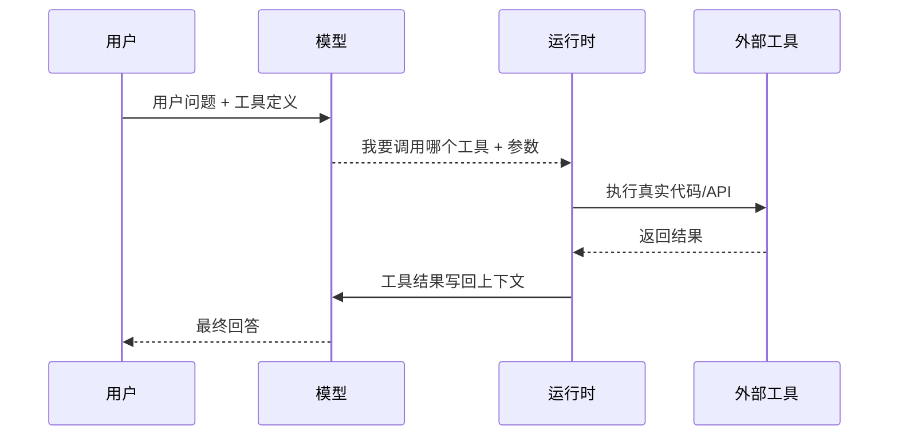
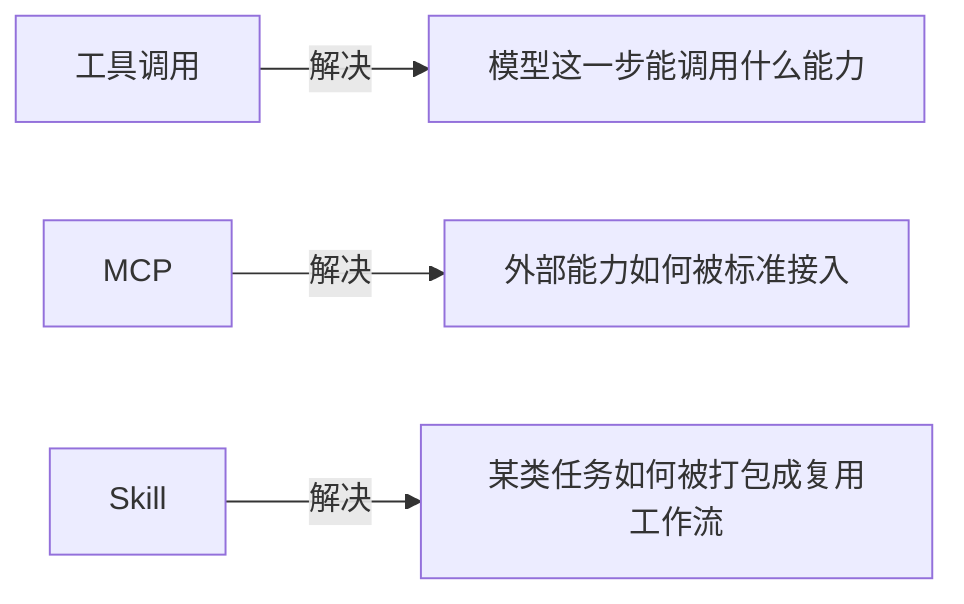

# 工具调用

> 这一章你会学会什么
>
> 1. 工具调用到底是什么，不是什么。
> 2. 一个工具从设计到被模型调用，整个链路长什么样。
> 3. 工具调用、MCP、Skill 有什么区别。
> 4. 不同厂商在工具调用上有哪些共识与差异。
> 5. 最小代码怎么写，真实项目怎么参考。

## 1. 先记住一句话

工具调用不是“模型自己执行代码”，而是：

```text
你把工具描述给模型
-> 模型产出结构化调用意图
-> 你的程序执行工具
-> 再把结果喂回模型
```

OpenAI、Anthropic、智谱、MiniMax 的官方文档都遵循这个基本思路，只是字段命名和消息格式略有差异。[1][2][3][4]

## 2. 一张图看懂调用链



这张图里最关键的一点是：  
`执行工具的是 Runtime，不是模型。`

## 3. 一个工具最少要包含什么

从主流平台的设计看，一个工具至少包含 3 个部分：

1. `name`
   工具名，越清晰越好。
2. `description`
   告诉模型“什么时候该用它”。
3. `parameters / input_schema`
   用 JSON Schema 或结构化字段约束输入。[1][2][3][4]

### 3.1 一个好的工具定义长什么样

```json
{
  "type": "function",
  "function": {
    "name": "get_weather",
    "description": "查询指定城市当前天气。只有当用户询问天气时才调用。",
    "parameters": {
      "type": "object",
      "properties": {
        "city": {
          "type": "string",
          "description": "城市名，例如 Beijing"
        }
      },
      "required": ["city"]
    }
  }
}
```

你会发现，好的工具定义其实在做一件事：  
`替模型消歧义。`

## 4. 一个最小代码演示

下面是一个非常小的、OpenAI 风格的工具调用示例。重点不是 API 细节，而是理解“模型出意图，程序去执行，再把结果回填”。

```python
from openai import OpenAI
import json

client = OpenAI()


def get_weather(city: str) -> str:
    fake_db = {
        "Beijing": "晴，15 摄氏度",
        "Shanghai": "多云，18 摄氏度",
    }
    return fake_db.get(city, "没有查到该城市天气")


tools = [
    {
        "type": "function",
        "function": {
            "name": "get_weather",
            "description": "查询指定城市天气",
            "parameters": {
                "type": "object",
                "properties": {
                    "city": {"type": "string", "description": "城市名"}
                },
                "required": ["city"],
            },
        },
    }
]

messages = [{"role": "user", "content": "帮我查一下 Beijing 今天天气"}]

resp = client.chat.completions.create(
    model="gpt-4.1-mini",
    messages=messages,
    tools=tools,
)

tool_call = resp.choices[0].message.tool_calls[0]
args = json.loads(tool_call.function.arguments)
result = get_weather(args["city"])

messages.append(resp.choices[0].message)
messages.append(
    {
        "role": "tool",
        "tool_call_id": tool_call.id,
        "content": result,
    }
)

final_resp = client.chat.completions.create(
    model="gpt-4.1-mini",
    messages=messages,
)

print(final_resp.choices[0].message.content)
```

### 4.1 这段代码里最重要的 4 行

1. `tools=tools`
   把工具定义交给模型。
2. `tool_calls[0]`
   读取模型选择了哪个工具。
3. `get_weather(args["city"])`
   你的程序执行真实工具。
4. `role="tool"`
   把工具结果写回对话历史。

这就是工具调用的最小闭环。

## 5. 工具是怎么“装入上下文”的

这部分很多初学者会忽略，但它非常关键。  
OpenAI 官方明确说过，函数定义会被注入到模型能理解的特殊 system-format 里，因此工具定义会占用上下文和 token。[1]

这带来三个直接结论：

1. 工具不是免费元数据。
2. 工具越多、描述越长，上下文压力越大。
3. 最好按任务动态暴露工具，而不是一次性把所有工具都塞进去。

Anthropic 的工具使用文档也强调：工具配置和 system prompt 一起决定模型如何理解工具；消息格式和 `tool_result` 回填顺序必须严格正确。[2]

## 6. 工具调用、MCP、Skill 的区别

这是最容易混淆的一组概念。



### 6.1 工具调用

工具调用关注的是：  
`这一轮模型能调用什么函数/工具，以及参数怎么传。`

### 6.2 MCP

MCP 是协议层。它标准化的是：

1. host/client/server 怎么协作
2. tools 怎么暴露
3. resources 怎么暴露
4. prompts 怎么暴露。[5]

所以 MCP 不是一个具体工具，而是一种“接入标准”。

### 6.3 Skill

Skill 更像“任务说明书 + 可选脚本 + 参考资料”的打包格式。  
OpenAI Codex 的 skill 文档强调，skill 会采用 progressive disclosure：先看 metadata，只有确定要用时才加载完整 `SKILL.md`。[6]

所以你可以把三者记成：

1. `工具调用`：这一步调什么
2. `MCP`：怎么接这些能力
3. `Skill`：这一类任务怎么做

## 7. 工具设计的 6 条硬规则

### 7.1 工具只做一件事

坏例子：`process_data_everything`  
好例子：`search_docs`、`run_sql`、`send_email`

### 7.2 描述里写清触发条件

不要只写“查询信息”。  
更好的是写“当用户明确询问天气时调用”。

### 7.3 参数尽量结构化

用枚举、必填字段、对象嵌套，把输入空间缩小。[1][2]

### 7.4 不让模型猜开发者已知参数

比如当前用户 ID、当前环境、租户 ID，很多时候应该由运行时注入，而不是让模型自己编。

### 7.5 工具返回值也要结构化

坏例子：一大段不可解析文本  
好例子：

```json
{
  "status": "ok",
  "city": "Beijing",
  "temperature_c": 15,
  "condition": "晴"
}
```

### 7.6 高风险动作必须审批

OpenAI 的 MCP 指南和 Anthropic 的 MCP connector 文档都强调了审批、信任边界和提示注入风险。[7][8]

## 8. 跨厂商实践

### 8.1 OpenAI

OpenAI 的重点是：

1. `function calling`：最经典的工具调用入口。[1]
2. `remote MCP`：让模型通过 MCP 服务器获得新工具。[7]
3. `Skills`：把某类任务经验封成工作流资产。[6]

对初学者最有帮助的理解方式是：  
OpenAI 把“函数级工具调用”和“协议级能力接入”都铺好了。

### 8.2 Anthropic

Anthropic 的工具调用强调两件事：

1. `tool_result` 消息格式必须严格正确。[2]
2. 高工具密度场景下，要关注 token-efficient tool use。[8]

这说明 Anthropic 很重视“调用链协议正确性”和“调用成本”。

### 8.3 Moonshot / Kimi

Moonshot 更常在官方博客和 Playground 里强调“让 Kimi 从聊天助手升级为能调用外部工具的智能助理”。[9]  
对学习者的启发是：工具调用不只是一个 API 特性，而是产品能力升级的拐点。

### 8.4 智谱

智谱把 `Function Calling` 明确做成官方能力，同时提供 OpenAI 兼容接口。[3][10]  
这对工程团队很现实：如果你已经是 OpenAI 风格调用链，迁移成本会更低。

### 8.5 MiniMax

MiniMax 提供独立的 function call 指南，并把工具使用和更复杂的交错思维链结合起来讲。[4][11]  
这提醒我们：在某些 agentic model 里，工具调用不只是函数分发问题，还和中间状态保真有关。

## 9. 真实项目怎么学

### 9.1 `openai/openai-agents-python`

适合看：

1. agent 怎么声明
2. tool 怎么封装
3. handoff 怎么做
4. guardrail 怎么加

项目地址：  
https://github.com/openai/openai-agents-python

### 9.2 `modelcontextprotocol/servers`

适合看：

1. MCP server 的目录结构
2. tools/resources/prompts 怎么暴露
3. 不同 server 样例

项目地址：  
https://github.com/modelcontextprotocol/servers

### 9.3 `jlowin/fastmcp`

适合看：

1. 怎么更快写一个 MCP server
2. Python 开发者如何把已有函数包装成 MCP 能力

项目地址：  
https://github.com/jlowin/fastmcp

### 9.4 `langchain-ai/langgraph`

适合看：

1. 工具节点怎么接到图里
2. 工具结果如何进入状态流转

项目地址：  
https://github.com/langchain-ai/langgraph

### 9.5 `MiniMax-AI/Mini-Agent`

这个项目非常适合拿来观察“工具层怎么从 demo 走向工程”：

1. 本地工具层
   它默认接了文件读写、编辑、Bash 等基础工具，适合做真实任务闭环。[16]
2. MCP 工具层
   `mcp_loader.py` 不是把 MCP 当概念，而是做成了真正的连接器，支持 stdio、sse、http / streamable_http，并带连接超时和执行超时。[17]
3. Skill 层
   `skill_tool.py` 里的 `get_skill` 展示了很典型的 progressive disclosure：先让模型知道“有哪些 skill”，需要时再把完整 skill 内容拉进来。[18]

如果你想理解“工具调用、MCP、Skill 三层是怎么在一个项目里并存的”，Mini-Agent 是很好的练习材料。[16][17][18]

项目地址：  
https://github.com/MiniMax-AI/Mini-Agent

## 10. 初学者最常犯的错

1. 一次给模型 30 个工具，希望它自己选对。
2. 工具描述过短，两个工具看起来都像“查询信息”。
3. 工具结果返回大段自然语言，下一步难以消费。
4. 高风险操作没有审批。
5. 把“工作流”硬塞进单个工具实现，导致工具越来越胖。

## 11. 这一章的练习

你可以自己试着做下面两个练习：

1. 把天气工具改造成“机票查询工具”，要求返回结构化 JSON。
2. 自己写一个 `search_local_notes` 工具，把本地笔记字典当知识库，模拟一次工具调用闭环。

## 参考来源

[1] OpenAI, Function calling.  
https://platform.openai.com/docs/guides/function-calling

[2] Anthropic, How to implement tool use.  
https://docs.anthropic.com/en/docs/agents-and-tools/tool-use/implement-tool-use

[3] 智谱AI开放文档, 工具调用.  
https://docs.bigmodel.cn/cn/guide/capabilities/function-calling

[4] MiniMax 开放平台文档中心, MiniMax M1 函数调用（Function Call）功能指南.  
https://platform.minimaxi.com/docs/guides/text-function-call

[5] Model Context Protocol, Architecture overview.  
https://modelcontextprotocol.io/docs/learn/architecture

[6] OpenAI Developers, Agent Skills – Codex.  
https://developers.openai.com/codex/skills

[7] OpenAI, Connectors and MCP servers.  
https://platform.openai.com/docs/guides/tools-remote-mcp

[8] Anthropic, Token-efficient tool use.  
https://docs.anthropic.com/en/docs/agents-and-tools/tool-use/token-efficient-tool-use

[9] Moonshot AI, Kimi Playground 一站式体验 Kimi K2 的工具调用能力.  
https://platform.moonshot.cn/blog/posts/kimi-playground

[10] 智谱AI开放文档, OpenAI API 兼容.  
https://docs.bigmodel.cn/cn/guide/develop/openai/introduction

[11] MiniMax 开放平台文档中心, 工具使用 & 交错思维链.  
https://platform.minimaxi.com/docs/guides/text-m2-function-call

[12] OpenAI Agents SDK GitHub.  
https://github.com/openai/openai-agents-python

[13] MCP Servers GitHub.  
https://github.com/modelcontextprotocol/servers

[14] FastMCP GitHub.  
https://github.com/jlowin/fastmcp

[15] LangGraph GitHub.  
https://github.com/langchain-ai/langgraph

[16] Mini-Agent GitHub README.  
https://github.com/MiniMax-AI/Mini-Agent/blob/main/README.md

[17] Mini-Agent `mcp_loader.py`.  
https://github.com/MiniMax-AI/Mini-Agent/blob/main/mini_agent/tools/mcp_loader.py

[18] Mini-Agent `skill_tool.py`.  
https://github.com/MiniMax-AI/Mini-Agent/blob/main/mini_agent/tools/skill_tool.py