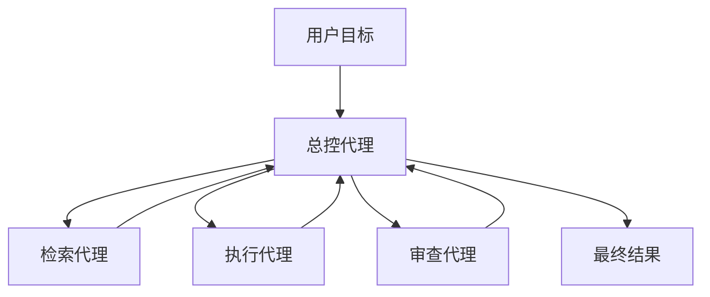

# 多智能体架构设计

> 这一章你会学会什么
>
> 1. 多智能体到底解决什么问题。
> 2. 哪些多智能体范式最常见、最值得学。
> 3. 什么时候该上多代理，什么时候不该上。
> 4. 主流框架和热门 GitHub 项目分别代表什么思路。

## 1. 先说结论

多智能体不是“代理越多越强”，而是：

```text
当一个代理的职责太多、上下文太杂、流程太长时，
把问题拆成多个有边界的代理，通常会更稳。
```

Google ADK、AutoGen、CrewAI、MetaGPT 等资料都在说明同一件事：  
多代理的价值主要来自 `分工`、`治理`、`复用` 和 `可维护性`。[1][2][3][4]

## 2. 一张图先建立直觉



多智能体本质上是在做两件事：

1. 拆职责
2. 控协作

## 3. 最常见的 6 种范式

### 3.1 Coordinator / Dispatcher

一个总控代理负责路由，其他代理各做一类任务。[1]

适合：

1. 请求类型很多
2. 每类任务边界比较清晰

### 3.2 Sequential Pipeline

多个代理按固定顺序传递结果。[1]

适合：

1. 步骤稳定
2. 每一步输出天然是下一步输入

### 3.3 Parallel Fan-Out / Gather

并行把子任务发给多个代理，再收束结果。[1]

适合：

1. 多路检索
2. 多方案比较
3. 研究类任务

### 3.4 Hierarchical Decomposition

父代理负责大目标，子代理负责子问题。[1]

适合：

1. 长任务
2. 项目式任务
3. 分层抽象明显的场景

### 3.5 Generator-Critic / Reviewer

一个代理负责生成，另一个代理负责挑错和验收。[1]

适合：

1. 代码
2. 长报告
3. 风险高的输出

### 3.6 Human-in-the-Loop

关键步骤让人来批准。[1]

适合：

1. 高风险动作
2. 涉及合规
3. 删除、转账、发版等不可逆动作

## 4. 一个最小多智能体示例

下面这个示例故意用最简单的 Python 规则来模拟“总控 + 子代理”。

```python
def research_agent(task: str) -> str:
    return f"[研究代理] 已整理资料：{task}"


def writing_agent(task: str) -> str:
    return f"[写作代理] 已生成草稿：{task}"


def review_agent(task: str) -> str:
    return f"[审查代理] 已检查风险：{task}"


def coordinator(user_goal: str) -> dict:
    research = research_agent(user_goal)
    draft = writing_agent(research)
    review = review_agent(draft)

    return {
        "research": research,
        "draft": draft,
        "review": review,
        "final": "总控代理汇总完成",
    }


print(coordinator("写一篇关于 RAG 的入门介绍"))
```

### 4.1 这段代码体现了什么

1. 总控代理不一定自己干活
2. 子代理应该有清晰职责
3. 汇总逻辑应该单独存在

这就是很多多代理系统的最小雏形。

## 5. 什么时候真的值得上多代理

适合：

1. 单代理已经太胖
2. 子任务可以清晰拆分
3. 不同角色有不同关注点
4. 你需要 review / approval / audit
5. 你需要并行处理多个独立子任务

不适合：

1. 单代理已经能稳稳完成
2. 子任务边界不清楚
3. 你还没有 eval 和 tracing
4. 任务太小，协作成本比收益大

## 6. 跨厂商和框架实践

### 6.1 Google ADK：最适合学“范式”

Google ADK 的文档把常见模式写得非常清楚：协调分发、顺序流水线、并行汇聚、层级分解、review/critique、人类参与。[1]

如果你是初学者，ADK 文档最大的价值不是“教你某个框架 API”，而是让你先形成结构感。

### 6.2 OpenAI Agents SDK：适合学 handoff

OpenAI Agents SDK 更适合学这些点：

1. agent 封装
2. handoff
3. tool
4. guardrail

它的优势是“从单代理到多代理”的路径比较连贯。[5]

### 6.3 AutoGen：适合学对话式协作

AutoGen 的代表思路是：  
让多个可对话 agent 协作完成复杂任务。[2][6]

适合你思考：

1. 代理之间如何相互提问
2. 怎么控制谁先说、谁后说

### 6.4 CrewAI：适合学角色分工

CrewAI 的代表思路是：

1. 定义角色
2. 给任务
3. 安排协作

它很适合把“组织分工”映射进代理系统。[3]

### 6.5 MetaGPT：适合学“公司式协作”

MetaGPT 的经典思路是把软件公司 SOP 映射成多角色团队。[4]  
对初学者很有帮助的一点是：  
它让你更容易理解“多智能体不是随便多开几个模型”，而是要有组织流程。

### 6.6 MiniMax：适合看 cookbook 式案例

MiniMax 的方案文档里有 Mini-Agent 和使用多智能体完成复杂任务的例子。[7][8]  
它们更像“做法示范”，适合学习如何把多代理做成真正的可运行方案。

## 7. 真实项目怎么学

### 7.1 `microsoft/autogen`

适合看：

1. 多 agent 对话编排
2. 代理间协作
3. code execution / tool use 的嵌入方式

项目地址：  
https://github.com/microsoft/autogen

### 7.2 `crewAIInc/crewAI`

适合看：

1. role + task + process 的组织方式
2. 角色化代理设计

项目地址：  
https://github.com/crewAIInc/crewAI

### 7.3 `FoundationAgents/MetaGPT`

适合看：

1. 公司式角色拆分
2. SOP 思维

项目地址：  
https://github.com/FoundationAgents/MetaGPT

### 7.4 `google/adk-python`

适合看：

1. ADK 的 Python 端工程结构
2. 多代理工作流如何实际组织

项目地址：  
https://github.com/google/adk-python

## 8. 一张选型表

| 你的问题 | 更适合的范式 |
| --- | --- |
| 请求类型很多，想统一入口 | Coordinator |
| 处理流程固定 | Sequential Pipeline |
| 需要多路搜索和汇总 | Parallel Fan-Out |
| 任务很长、可分层 | Hierarchical |
| 结果风险高，需要审查 | Generator-Critic |
| 有审批要求 | Human-in-the-Loop |

## 9. 一个实用建议

多代理最好按下面顺序上：

1. 先把单代理做稳
2. 再确定拆分边界
3. 再决定要不要并行
4. 再加 review / approval
5. 最后才考虑更复杂的开放式多代理对话

这条顺序很重要。  
很多系统的问题不是“代理不够多”，而是“边界不清、状态混乱、评估缺失”。

## 10. 一个很重要的反例提醒：先把单代理做扎实

MiniMax 的 Mini-Agent 其实很值得放在多代理教程里当“反例提醒”。  
原因不是它是多代理框架，而是它恰好说明：

1. 一个单代理系统只要把执行循环、工具、MCP、Skill、记忆、摘要、日志做好，就已经能承担很复杂的真实任务。[10][11]
2. 很多团队真正缺的不是“再多一个代理”，而是“先把当前代理的状态管理和工具链跑顺”。（综合归纳）[10][11]

所以，多代理学习里最重要的一条原则其实是：

```text
如果单代理的执行循环还不稳，
请先修单代理，不要急着用多代理掩盖问题。
```

## 11. 这一章的练习

1. 把最小示例改成“总控 + 检索 + 写作 + 审查”四代理。
2. 给总控代理加一个“用户确认”步骤。
3. 比较一下：这个任务真的需要 4 个代理吗？能不能 2 个就够？

## 参考来源

[1] Google ADK Docs, Multi-Agent Systems in ADK.  
https://google.github.io/adk-docs/agents/multi-agents/

[2] Wu et al., AutoGen, arXiv:2308.08155.  
https://arxiv.org/abs/2308.08155

[3] CrewAI GitHub.  
https://github.com/crewAIInc/crewAI

[4] MetaGPT GitHub.  
https://github.com/FoundationAgents/MetaGPT

[5] OpenAI Agents SDK GitHub.  
https://github.com/openai/openai-agents-python

[6] AutoGen GitHub.  
https://github.com/microsoft/autogen

[7] MiniMax 开放平台文档中心, Mini-Agent：构建您的第一个智能助手.  
https://platform.minimaxi.com/docs/solutions/mini-agent

[8] MiniMax 开放平台文档中心, 使用多智能体完成复杂任务.  
https://platform.minimaxi.com/docs/solutions/eigent

[9] google/adk-python GitHub.  
https://github.com/google/adk-python

[10] Mini-Agent GitHub README.  
https://github.com/MiniMax-AI/Mini-Agent/blob/main/README.md

[11] Mini-Agent `agent.py`.  
https://github.com/MiniMax-AI/Mini-Agent/blob/main/mini_agent/agent.py